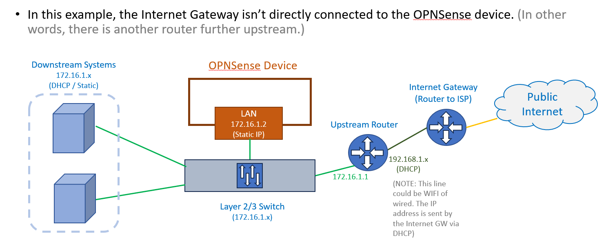

# OPNSense Installation (LAN only)
OPNSense is an opensource network security solution.
>(REFERENCE: [https://opnsense.org/](https://opnsense.org/))

>(NOTE: This installation is if you already have a router upstream that connects to the Internet
> Gateway AND you only plan on using OPNSense for DHCP and DNS. This configuration WILL NOT be useful if you
> plan on using OPNSense as a firewall. In that case you should use the installation file here: [../OPNSENSE_INSTALL.md](../OPNSENSE_INSTALL.md))

Your network topology for this installation should look something like this:



>(THOUGHTS: I tried using OPNSense's built-in WIFI support and didn't have a lot of luck. It seems like the BSD Kernel support for USB)
> WIFI adapters is pretty bad. I couldn't maintain a consist connection with 3 different wifi adapters. So, I'm using this
> simpler approach instead. This works for me, because I won't need a Firewall, just DNS and DHCP support. I was really hoping
> to eliminate the upstream WIFI router, but it will have to stay in place, for now.)

## Hardware
OPNSense should be able to run on a low-end mini computer.  This machine will need 1+ Network Card Interfaces (NIC)s.
If you will be performing routing or using this device as a firewall, you will need at least two NICs.

My example machine has the following specs:
- Pentium(R) Silver J5005 CPU with 4 cores/4 threads
- 8 GB of memory
- ~500 GB Hard drive

## Create the OPNSense boot media
### Install Etcher
You will need a free USB stick and something like `Etcher` to write the ISO image. Etcher can be downloaded
at this location: [https://etcher.balena.io/](https://etcher.balena.io/)

### Download the OPNSense Iso
Download the latest OPNSense ISO here: [https://opnsense.org/download/](https://opnsense.org/download/)

### Write the ISO image to your USB drive using Etcher
Using the etcher application write the iso image of OPNSense to your USB stick.

## Install OPNSense
### Boot up a mini PC with the OPNSense USB stick
You may have to change your BIOS settings to make USB booting a priority.  Insert the USB
stick and boot up the mini computer

### Install from the command prompt
You should see a `login` prompt. Use the following credentials to login for the first time:

- **login** - `installer`
- **password** - `opnsense`

### Initial Setup
- **Keymap Selection** - Keep this default
- **Install (ZFS)** - Select the defaults here too
- **Virtual Device Type** - Select `Stripe`
- Click the `space` bar to select the hard drive you want to install on
- Click `Yes` to validate that it's ok to destroy the current disk data and install

At this point, the installation will take a few minutes.

- **Change the Root Password** - You can optionally change the Root password here.
- **Complete Install** - Select `Exit and Reboot`

>(NOTE: Make sure to remove the USB drive!)

### Post Install setup
Login as `root` using the password you setup in the last step of the initial setup.

- Click `2` to `Set interface IP address` and press enter.
- Select `1` to update the `LAN` address
  - Select 'N' to manually setup the LAN interface
  - Enter the IP address. (In my case, I'm using 192.168.3.2)
  - Enter the IPv4 Subnet. (In my case my network is a class C, so I will be using `24`)
  - Press `Enter` for none. (NOTE: In my case, I'm using a different WAN device that resides off the LAN network (192.168.3.1), make changes for your network topology)
  - Click `N` to skip IPv6 setup.
  - Select the defaults for IPv6, leaving everything blank and disabling any use of IPv6
  - Select `Y` to enable DHCP on the LAN interface
  - Enter the start IP address for DHCP. (In my example, I'll start with 192.168.3.200)
  - Enter the end IP address for DHCP. (In my example, I'll start with 192.168.3.250)
  - Select `Y` to change the GUI protocol to HTTP from HTTPS. (NOTE: We will change it to HTTPS later, once certificates are installed)
  - Select `N` to restore the GUI access defaults

### Run the Configuration Wizard from a web browser
You should now be able to access OPNSense from a web browser using the IP address of the LAN interface.
In my case I can access the GUI using the following URL: [http:/192.168.3.2](http://192.168.3.2)

You will be prompted with a wizard. You can mostly use the defaults here. These are the values I'm 
using during initial setup:

- **Hostname** - You can leave this default
- **Domain** - I'm adding a domain for a self-signed TLS cert that I have.
- **Unbound DNS** - Check `Enable Resolver`

- Leave the remaining values as default, unless you have specific changes. Click `Next`
- Leave the Time server values as default. Click `Next`
- Leave the WAN settings as default and click `Next`
- The LAN IP address should already be setup from the Inital installation. Click `Next`
- You can click `Next` again at the `Set Root Password` screen, unless you want to change it again.
- Click `Reload`

### Setup Unbound DNS
From the GUI main menu, select the following:

`Services` -> `Unbound DNS` -> `General`

The only things that should be select are:

- **Enable Unbound** - This should be checked
- **Listen Port** - This should be set to port `53`
- **Enable DNSSEC Support** - This should be checked
- **Enable DNS64 Support** - This should be checked
- **DNS64 Prefix** - This should have a prepopulated value. Don't worry about this too much.
- **TXT Comment Support** - This should be checked.
- **Flush DNS Cache during reload** - This should be checked
- **Local Zone Type** - `transparent`

### Setup Unbound DNS to use External DNS
>(IMPORTANT!!! I'm not currently using the WAN interface on my OPNSense server. Instead, I have an internet
> gateway that is attached to the LAN Network. As a result, I need to disable the WAN Gateway and make a Gateway for the 
> LAN interface.  Your Network topology may vary.)

First, lets set up a LAN gateway. Go to the following menu item:

`System` -> `Gateways` -> `Configuration`

- Click the Plus `+` button.
- **Disable** - This should be unchecked
- **Name** - You can use any name here. I'm using `lan_gw`
- **Description** - Enter anything here or leave it blank.
- **Interface** - Select `LAN`
- **Address Family** - Select `IPv4`
- **IP Address** - This should be the IP address of the upstream gateway router. In my case its `192.168.3.1`
- **Upstream Gateway** - This should be checked
- **Far Gateway** - (default) This should be unchecked
- **Disable Gateway Monitoring** - This should be checked
- **Disable Host Route** - (default) This should be unchecked
- **Monitor IP** - (default) This should be empty
- **Mark Gateway as Down** - (default) This should be unchecked
- Click Save
- Click Apply

>(IMPORTANT!!!!! In my case the following step is critical)
You may also have to disable the WAN Gateway

From the: `System` -> `Gateways` -> `Configuration` menu, click the green arrow next to `WAN_GW`, it should now be
grey in color.

- Click Apply

At this point your Gateways should be setup correctly.

### Set up an external DNS root server for public DNS resolution
Go to the following menu:

`System` -> `Settings` -> `General`

In the `Networking` section, add a DNS server:

- **DNS Server** - I'm using `8.8.8.8`
- **Use Gateway** - Select the LAN gateway you created in the last step. Mine would be `lan_gw`
- Click `Save`


### Setting Overrides for local domains
One of the most useful things you can do with Unbound DNS is setup DNS records for local DNS resolution.
This is useful if you're creating `*.local` or `*.lan` DNS entries for your lab services.

Go to the following menu to setup a customer DNS Host entry:

`Services` -> `Unbound DNS` -> `Overrides`

Click the `Host Overrides` tab then click the plus `+` button. Now enter the following fields, making
changes for your own host/domain names:

- **Enabled** - This should be checked
- **Host** - This can be any host you want, in my case I'll use `opnsense`
- **Domain** - Again, this can be your own personal domain name. In this example, I'll use `heavymetalcloud.lan`
- **Type** - A (IPv4 address)
- **IP Address** - This should be the IP address associated with the host/domain. In my case, this will be `192.168.3.2` which will resolve from `opnsense.heavymetalcloud.lan`
- **Description** - You can enter anything here or leave it blank.
- Click `Save`
- Click `Apply`

### Testing Unbound DNS (local Domains)
From another computer on the same LAN network, validate that you can resolve DNS for the host/domain overrides
you just created.  Run the following from a command prompt:

```shell
nslookup

### Change this address to your OPNSense server IP
server 192.168.3.2
opnsense.heavymetalcloud.lan
```

You should see output that looks something like this:
```
Server:  [192.168.3.2]
Address:  192.168.3.2

Name:    opnsense.heavymetalcloud.lan
Address:  192.168.3.2
```

### Testing Unbound DNS (Public Domains)
You should also be able to resolve public domains, as well.

```shell
nslookup

### Change this address to your OPNSense server IP
server 192.168.3.2
google.com
```

You should see output that looks something like this:
```
Server:  [192.168.3.2]
Address:  192.168.3.2

Non-authoritative answer:
Name:    google.com
Addresses:  2607:f8b0:4009:81b::200e
          142.250.191.238
```

## DHCP
### Setup DHCP
From the main menu:

`Services` -> `ISC DHCPv4` -> `[LAN]`

Everything should be default, with just the following settings updated:

- **Enabled** - This should be checked for the LAN interface
- **Range** - Set the IP range you want allocated for DHCP
- Click `Save`

Now you can test out DHCP using a client on the same network.

## Firewall Setup
### Set Firewall Optimization
This setting will increase stateful session timeouts. (Tries to avoid dropping any legitimate idle connections at the expense of increased memory usage and CPU utilization.)

From the main menu:

`Firewall` -> `Settings` -> `Advanced`

- **Firewall Optimization** - Select `conservative`
- Click the `Save` button

### Adjusting State settings (Option #1)
Sometimes, traffic can be denied based on the 'sloppy' state. Below are some settings to fix it.

>(REFERENCES:
> - [https://forum.opnsense.org/index.php?topic=18731.0](https://forum.opnsense.org/index.php?topic=18731.0)
> - [https://docs.netgate.com/pfsense/en/latest/troubleshooting/asymmetric-routing.html](https://docs.netgate.com/pfsense/en/latest/troubleshooting/asymmetric-routing.html))

From the main menu:

`Firewall` -> `Settings` -> `Advanced`

- **Static route filtering** - Check this box
- Click the `Save` button

### Adjusting State settings (Option #2)
You can also adjust the state settings directly against the interface Rules

From the main menu:

`Firewall` -> `Rules` -> `LAN`

First, create (or modify) the allow/any traffic rule. Then edit the rule and make the following change:

>(IMPORTANT!!! You should have an `inbound` and `outbound` rule. Make these changes to both!)

- **Advanced Features** - click the `Show/Hide` button to show all options.
- **State Type** - Select `sloppy state`
- Click the `Save` button
- Click the `Apply Changes` button

## Set up the Portal for TLS and DNS
### Dependencies
You will need a self-signed TLS certificate with a Certificate Authority. These certificates have to be
carefully created, or OPNSense will reject them.

In addition to the TLS certificate, you should already have set up a host override for `Unbound DNS`.
For this example, I will assume you have `opnsense.heavymetalcloud.lan` setup as an override domain. I will
also assume the self-signed certificate you created uses this domain, as well.

### Set up the Certificate Authority (CA) Certificate
From the main menu:

`System` -> `Trust` -> `Authorities`

Add a Certificate Authority here using the plus `+` button and set the following:

- **Method** - `Import an existing Certificate Authority`
- **Description** - You can put anything here, like `Example CA Cert`
- **Certificate data** - Paste your CA cert here.
- **Private key data** - You can leave this blank for the CA cert.
- **Serial for next certificate** - You can leave this blank.
- Click `Save`

### Set up the Server Certificate for OPNSense
From the main menu:

`System` -> `Trust` -> `Certificates`

Add a Server Certificate here using the plus `+` button and set the following:

>(IMPORTANT!!!! The Server key MUST be in RSA format. It can not be an encrypted key. If your key is
> encrypted, you can generate an RSA cert using the following command: `openssl rsa -in encrypted.key -out unencrypted.key`)

- **Method** - `Import an existing Certificate Authority`
- **Description** - You can put anything here, like `Example Server Cert`
- **Certificate data** - Paste your Server cert here.
- **Private key data** - Paste your Server key here in RSA format!
- Click `Save`

### Setup OPNSense to use a domain and TLS
First, let's make sure the host/domain are setup correctly. From the main menu:

`System` -> `Settings` -> `General`

Set the following:

- **Hostname** - This is the hostname for OPNSense GUI. I'm using `opnsense`
- **Domain** - Enter the domain of your TLS cert and for the DNS override you created. (For example: `example.lan`)
- Click `Save`

From the main menu:

`System` -> `Settings` -> `Administration`

Leave everything default except for the following parameters:

- **Protocol** - `HTTPS`
- **SSL Certificate** - Select the Server Certificate you just created.
- Click `Save`

You should now be able to access the GUI using the domain name you set up. (For example: [https://opnsense.heavymetalcloud.lan](https://opnsense.heavymetalcloud.lan)) 

>(IMPORTANT!!!!! You will have to load the Certificate Authority and Server certificates into your PC
> that you are accessing the GUI. I'm assuming you already know how to add certificates into your Operating System.)

## Plugins and Reverse Proxy install
If you want to install a Reverse Proxy (load balancer) or other Plugins, continue to the following document: [REVERSE_PROXY.md](REVERSE_PROXY.md)