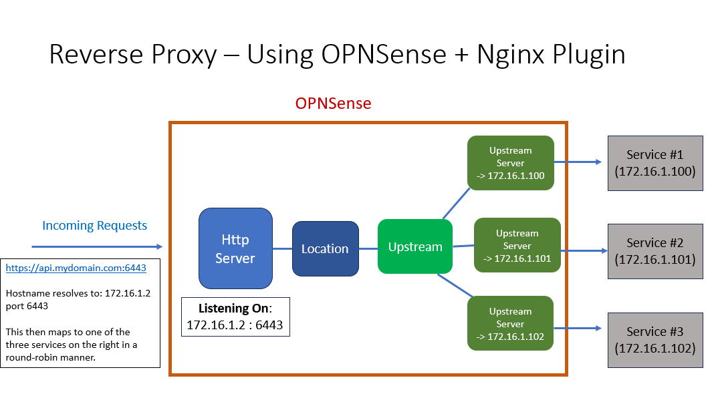
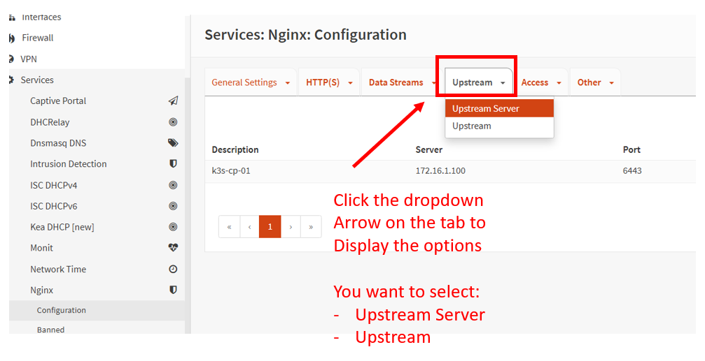
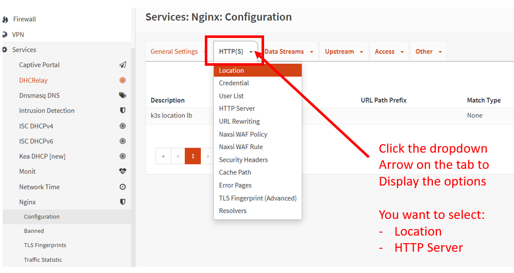
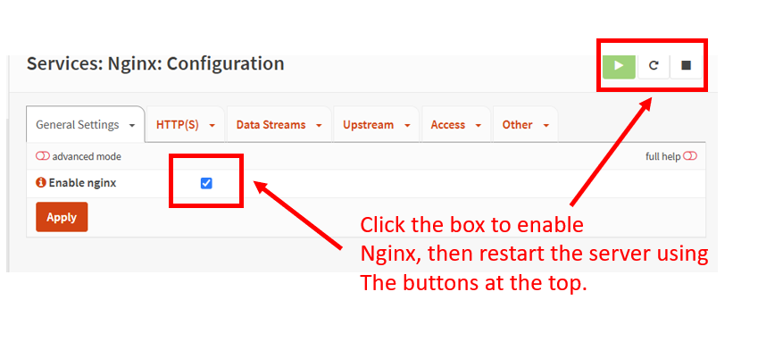

# Install a Reverse Proxy (Load Balancer) into OPNSense
OPNSense includes a lot of functionality out of the box, but I would also like to use this server as a 
Reverse Proxy (Load Balancer). Unfortunately, this doesn't come pre-installed. To get this going, OPNSense has a
large number of 3rd party plug-ins. One of these plug-ins is a Nginx Reverse Proxy.

## Install a 3rd party Plug-in
### Update your OPNSense server to the latest firmware
Before we install a plugin, let's update the firmware.

From the main menu:

`System` -> `Firmware` -> `Updates`

**Status** Tab
- Click the `Check for updates` button.

**Updates** tab
Update the firmware, if an update is available.


### Install the Nginx Plugin
From the main menu:

`System` -> `Firmware` -> `Updates`

**Plugins** Tab
- Search for `nginx`
- Highlight the `os-nginx` plugin row, and click the `+` button to install the plugin. (NOTE: This will take a few minutes.)

After a few minutes, you should see the following main menu item appear:
`Services` -> `Nginx`

## Architecture and Traffic Flow
>(REFERENCE: [https://docs.opnsense.org/manual/how-tos/nginx.html#nginx-basic-load-balancing](https://docs.opnsense.org/manual/how-tos/nginx.html#nginx-basic-load-balancing))

In this scenario, we want incoming traffic, to fan out to three different k8s control planes. This will give us redundancy
in case one control plane goes offline. It will provide High Availability (HA) to our Kubernetes cluster.  The traffic flow
will look something like this:

1. Incoming traffic will point to: https://k3s-api-01.heavymetalcloud.lan:6443/  (This domain resolves to 192.168.3.2, which is the OPNSense IP address)
2. OPNSense is Listening on 192.168.3.2 port 6443 via the Nginx `HTTP Server`
3. Within the Nginx subsystem, the `HTTP Server` will send the traffic to a `Listener`. The `Listener` acts as a gateway between the downstream and upstream traffic.
4. Again, within Nginx, the `Listener` hands off traffic to a `Upstream` component. The Upstream groups the upstream traffic to the individual services.
5. From inside Nginx, the `Upstream` then points to one or more `Upstream Servers`. These servers define the address of the actual services you want to connect to.
6. The traffic then is directed out of Nginx and Opnsense to the Upstream services (192.168.3.100, 192.168.3.101, etc.). In my case the upstream services will be a k8s control plane API service running on port 6443.

>(NOTES ON TERMINOLOGY: 
> - The term `Downstream` refers to the originating traffic from a client (Like me trying to access
> k8s using kubectl on my laptop). 
> - `Upstream` refers to the servers that you want to access. In my
> case the `Upstream` servers are the K8s control plane API services.)

Here's a diagram to better illustrate the traffic flow and architecture:



## Set up the Nginx Load Balancer
### Configure One, or more, Upstream Servers
>(NOTE: You should create a separate `Upstream Server` for each one of your services that you want to access. So, in my 
> case I have three k8s control plane API servers, I want to access. I would create three `Upstream Server` entries that each
> point to the IP address/port of each control plane API)

From the main menu:
`Services` -> `Nginx` -> `Configuration`

**Upstream -> Upstream Server** Tab (Click the down arrow to select)



- Click the `+` add button.
- **Description** - This should describe the upstream server. I'm using the hostname (k3s-cp-01)
- **Server** - This will be the IP address of your Upstream service. I'm entering the IP address of my k8s control plane (192.168.3.100)
- **Port** - This should be the port of the service upstream. I'm using port 6443, since this is the default k8s API access port.
- **Server Priority** - You can leave this default. I'm just using `1` for all my Upstream server configurations.
- Click the `Save` button.

Repeat this process for the remaining upstream services.

### Configure the Upstream
The `Upstream` is a grouping of the `Upstream Servers` you created in the last step. It provides the round-robin load
balancing between the `Upstream Servers`

From the main menu:
`Services` -> `Nginx` -> `Configuration`

**Upstream -> Upstream** Tab (Click the down arrow to select)
- Click the `+` add button.
- **Advanced mode** - Turn this option on
- **Description** - This should describe the upstream grouping. I'm using `k3s api LB`
- **Server Entries** - Select all the `Upstream Server` entries that you created in the previous step.
- **Load Balancing Algorithm** - You can leave this default: `Weighted Round Robin`
- **Enable TLS (HTTPS)** - (Checked) This options depends on whether your upstream service uses HTTPS. In my case, the k8s control plane API services use HTTPS, so I'm enabling this option.
- **TLS: Verify Certificate** - (Unchecked) In my case, this option is VERY important!!! Since the k8s control plane API is using self-signed certs, I don't want to verify TLS. So, I'm disabling this option.
- Click the `Save` button.

### Set up an HTTP(S) -> Location
A `Location` acts as an abstraction between the HTTP Server and the Upstream configurations from the previous steps.

From the main menu:
`Services` -> `Nginx` -> `Configuration`

**HTTP(S) -> Location** Tab (Click the down arrow to select)



- Click the `+` add button.
- **Advanced mode** - Turn this option on
- **Description** - This should describe the Location. I'm using `k3s location LB`
- **URL Pattern** - I'm using the root path: `/`
- **Upstream Servers** - Select the `Upstream` that you configured in the last step. I'm using `k3s api LB`
- **Server Entries** - Select all the `Upstream Server` entries that you created in the previous step.
- **Force HTTPS** - (Checked) This will depend if you're downstream services use HTTPS. It will force inbound traffic to convert to HTTPS if HTTP is coming in.
- Click the `Save` button.

### Set up an HTTP(S) -> HTTP Server
A `HTTP Server` is a web server that listens for requests on an IP/Port. Normally this traffic would go to HTML pages (or similar), but
we're using Nginx as a Reverse Proxy, so the traffic would instead flow to the `Location` from the previous step and then onto
the Upstream systems.

>(IMPORTANT!!!!! The `HTTPS Listen Address` MUST be an IP address that is bound to an interface on the OPNSense server. I'm using
> the default Ethernet port which has an IP of `192.168.3.2)`

From the main menu:
`Services` -> `Nginx` -> `Configuration`

**HTTP(S) -> HTTP Server** Tab (Click the down arrow to select)

- Click the `+` add button.
- **Advanced mode** - Turn this option on
- **HTTPS Listen Address** - This should be the IP/Port that traffic will listen to. This MUST be an IP address bound to the OPNSense intefaces. I'm using `192.168.3.2:6443`. The port `6443` is the default port used by the Kubernetes control plane API. So, I'm just leaving it the same from the downstream side.
- **Default Server** - (Checked) TODO: I need to revisit this setting. I'm not sure if it's needed.
- **Server Name** - This will be the domain name facing inbound to the OPNSense LB. I'm using `k3s-api-01.heavymetalcloud.lan`. (Note that this domain revolves to the IP of the OPNSense server `192.168.3.2`)
- **Location** - Select the `Location` that you set up in the previous step. I'm using `k3s location lb`
- **TLS Certificate** - Select a TLS certificate associated with the `Server Name`, you set up above. In my case, I have a wildcard cert for the domain, and I'm reusing that. Called, `Heavy Metal Cloud Wildcard`
- **Client CA Certificate** - Select a Cerfificate Authority (CA) cert that will trust the `Server Name`, you set up above. In my case, I already have a CA cert for the wildcard cert, and I'm reusing that. Called, `Heavy Metal Cloud CA`
- **Verify Client Certificate** - I have this set to `Off`, although in theory I could turn it on since I'm using legit certs from the downstream side.
- **HTTPS Only** - (Checked) Again, your situation may be different. In my case I'm using TLS certs with a CA.
- Click the `Save` button.

### Start Nginx 
With all the configs in place, we can start Nginx.

From the main menu:
`Services` -> `Nginx` -> `Configuration`

- **Enable nginx** - (Checked)



>(IMPORTANT!! You may have to restart the Nginx service a few times to make sure it's working)

### Testing the service
To test the service try access the `Downstream` side URL using curl or netcat (or a browser).

```shell
### In my case, I have the following URL already setup with a DNS entry so that it resolves to
### the IP address of the OPNSense ethernet port (192.168.3.2)
curl -k https://k3s-api-01.heavymetalcloud.lan:6443/

nc -zv k3s-api-01.heavymetalcloud.lan 6443
```

You should now see output that actually is coming from the `Upstream` services. In my case these are k8s control plane API servers
so the output looks like this:

```json
{
  "kind": "Status",
  "apiVersion": "v1",
  "metadata": {},
  "status": "Failure",
  "message": "Unauthorized",
  "reason": "Unauthorized",
  "code": 401
}
```