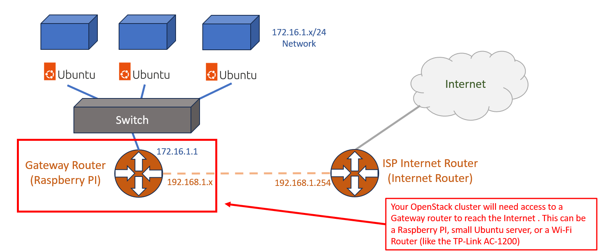

# Ubuntu Image installation
This document describes how to install Ubuntu from a USB drive.  For this process, I'm using
a USB image writer package called `Etcher`: https://etcher.io

Check out my YouTube Channel for more videos and content!
- [https://www.youtube.com/@HeavyMetalCloud](https://www.youtube.com/@HeavyMetalCloud)

## Dependencies

### Gateway Router
IMPORTANT!! It's assumed you have a **Gateway Router** setup with an interface of 192.168.3.1 255.255.255.0.  This will be the default
gateway for all the Cluster nodes to pull down Ubuntu packages and updates. It will also provide a route to the Internet.

This image shows the placement of the Gateway Router in relation to your Cluster servers and ISP Internet Router:



>(NOTE: The IP addresses may be different in your network. Especially the ISP Router network and interface.)

If you have a Raspberry PI or small Ubuntu server and want to use that as your gateway router, follow these instructions: [optional-technologies/internet-gateway-router/](optional-technologies/internet-gateway-router/) 
Otherwise, you could use an off-the-shelf device like a TP-Link AC1200 Wi-Fi Router to perform the same function.


## Create an Ubuntu Image on USB
1. Download Etcher at https://etcher.io
2. Download a server image of Ubuntu (I'm using 22.04 LTS server amd64).  [https://www.ubuntu.com/download/server](https://www.ubuntu.com/download/server)
   The file should end in `.iso`
3. Using Etcher from step 1, write the ISO image of Ubuntu onto a formatted USB drive.
4. Once the image has been written to the USB drive eject it from your computer.

## Install Ubuntu
1. Insert the USB drive into your Server.
2. Select the default `Try or Install ubuntu server` option or wait a few seconds for the installation to start.
3. Select the default values for language and keyboard.
4. Select `Ubuntu Server`
5. If DHCP is setup to the Internet you can continue. Otherwise, you will have to manually select an
   IP address and point to your default gateway for internet access. I'm using the (192.168.3.x/24 network with 192.168.3.2 as my first node and 192.168.3.1 as the gateway.)
   (IMPORTANT!! if you aren't using DHCP, make sure the DNS server is set. In my case that is 192.168.1.254)
6. If you have a Proxy server for Internet access, enter it next. Otherwise, leave this blank and
   continue.
7. Select the default mirror address `http:/archive.ubuntu.com/ubuntu`
8. Select `Use An Entire Disk` for the partitioner.
>(NOTE: If you will be setting up Kubernetes with Rook/Ceph.  Do NOT select 'Use An Entire Disk And Set Up LVM'.  Ceph
requires a raw device. Using LVM's will prevent the creation of OSD's.)
9. Select the drive to format and install then continue.
10. You will be prompted to verify if you want to erase the contents of the drive.  Select `Continue`
11. Enter Profile settings (NOTE: you can tweak these settings to match your environment):
    * Your name: `hmuser`
    * Your Server's Name: `platform01`, etc.
    * Pick a username: `hmuser`
    * 
    * Choose a password: `password`
    * Confirm your password: `password`
12. Check the box to `Install OpenSSH server`.  Leave the other settings default.
13. The server will now begin the install of Ubuntu.  This will take a few minutes.
14. Security updates will start downloading and installing.  This might take a very long time. You can skip it and install these updates later using the command `sudo apt-get dist-upgrade`
15. With the installation complete, remove the USB drive and select `Reboot Now`
15. Verify that you can login to the server using the credentials from step 11. above.
16. Verify that you can SSH into the server remotely using the IP address you used/entered in step 5.

## Install self-signed CA certs
If you're using self-signed certs (and you probably should for your lab) then perform the following
steps to install them:

>(NOTE: In this example the `bundle-cacert-mycert.crt` is a bundled cert with the
> intermediate (subordinate) cert first, then followed by the Certificate Authority (CA) cert, next.)

```shell
sudo cp cacert.crt /usr/local/share/ca-certificates
sudo update-ca-certificates
```


At this point Ubuntu should be installed. You can continue with the Platform server installation at: [../platform-server/README.md](../platform-server/README.md)

## Troubleshooting
### The LVM partition is not using the full disk for Ubuntu
>(REFERENCE: [https://askubuntu.com/a/1406922](https://askubuntu.com/a/1406922))

This issue will usually crop up if you're having trouble allocating PVC's to Longhorn or Ceph/rook

First, take a look at the current disk/partition settings:
```shell
lsblk 
## Also you can run the following command:
vgs
```

In my case, I noticed something like this:
```
nvme0n1            259:0    0 465.8G  0 disk
├─nvme0n1p1        259:1    0     1G  0 part /boot/efi
├─nvme0n1p2        259:2    0     2G  0 part /boot
└─nvme0n1p3        259:3    0 462.7G  0 part
  └─ubuntu--vg-ubuntu--lv
                   253:0    0   100G  0 lvm 
```

You can see from the last line, that the `lvm` disk is only `100G`, but we should have `462GB`
available. In this case, I want to grow the lvm partition to the full size of the disk.

```shell
### Show the available size of the partition
pvs

### Expand the partition to the full free disk size
###
##### (NOTE: the path below will vary based on your disks/partitions. You can 
##### use 'tab' autocomplete to help determine the file path.)
###
lvextend -l+100%FREE /dev/ubuntu-vg/ubuntu-lv

### View the current filesystem size
df -hPT /

### Resize the Filesystem
##### (NOTE: the path below will vary based on your disks/partitions. In my case
##### the name was pulled from the 'lsblk' command
resize2fs /dev/mapper/ubuntu--vg-ubuntu--lv

### Verify that the partition size has changed using the following commands:
df -hPT /
pvs
lsblk
```